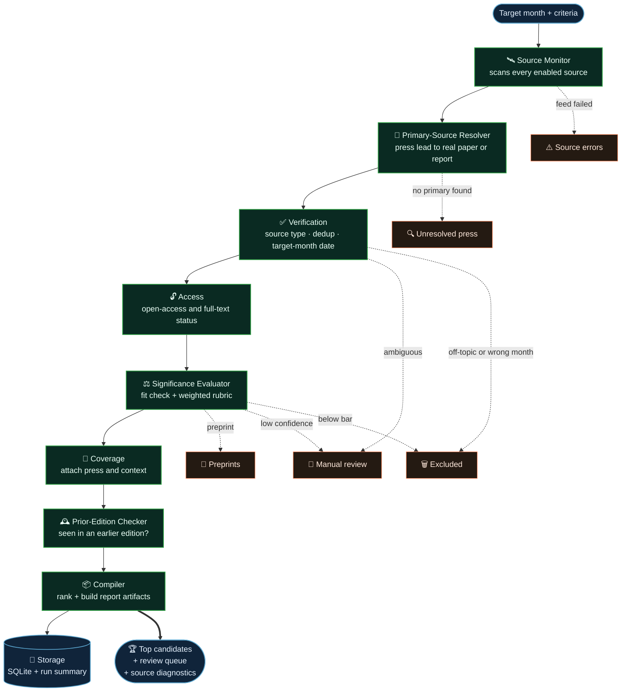

<p align="center">
  
</p>

<p align="center">
  <a href="#quickstart"></a>
  
  
  
  
  
</p>

# Hot Science Research Agents

A multi-agent pipeline that finds the **most significant climate and Earth-system research published in a given month** — then resolves every lead to its primary source, verifies the date, scores the significance, and hands the Hot Science team a report it can actually use.

Part of **DeepGreen**, the Bezos Earth Fund's agent platform. This is use case **UC-I-1**: automated scientific literature and report monitoring.

## Why Hot Science

A monthly science roundup is deceptively hard. The interesting papers are scattered across dozens of journals, preprint servers, agency data releases, and press feeds. Press coverage points at findings but rarely at the actual paper. Publication dates lie — an article that *appears* in April may have been published online in February. And "significant" is a judgment call that has to stay consistent month over month.

**The pipeline does the tedious parts so a human can do the judgment part.** It scans the sources, follows press leads back to the primary paper or report, pins down the real publication date, and applies one transparent rubric to every candidate. What lands on the analyst's desk is a ranked shortlist with evidence attached — not a search dump.

**Every decision is auditable.** Each candidate carries its resolution trail, its date verification, its per-dimension scores, and the rationale behind any exclusion. Nothing is a black box; you can always ask *why* an item was kept, flagged, or dropped.

**One pipeline, two front doors.** The command-line runner and the pilot web UI execute the exact same code path, so a result you see in the browser is the result you'd get from a scripted batch run.

> [!NOTE]
> **Design principle:** the system optimizes for *recall with explanation*. It would rather surface a borderline candidate into a manual-review bucket — with the reason attached — than silently discard something a human should see.

## How it works

The orchestrator runs eight specialized agents in sequence. Each agent does one job, annotates the shared `CandidateRecord`, and routes items forward or into a labeled bucket.



### The agent roster

| Agent | Responsibility | Routes to |
| --- | --- | --- |
| **Source Monitor** | Queries scholarly APIs, journal RSS, agency feeds, preprint servers, and press feeds for the target month. | raw candidates · *source errors* |
| **Primary-Source Resolver** | Follows press articles and discovery items back to the underlying paper or official report. | resolved candidates · *unresolved press* |
| **Verification** | Confirms source type, de-duplicates, and decides target-month eligibility from the **primary work's** publication date — not the press date. | verified · *manual review* · *excluded* |
| **Access** | Annotates open-access status, paywall state, and full-text/PDF availability. | annotated candidates |
| **Significance Evaluator** | Runs an evidence-backed fit check, then scores each candidate against the weighted rubric. | evaluated · *preprints* · *manual review* · *excluded* |
| **Coverage** | Attaches press coverage and contextual signals to surviving candidates. | candidates + coverage |
| **Prior-Edition Checker** | Flags anything that already appeared in a previous month's edition. | candidates + prior-edition notes |
| **Compiler** | Ranks the field, separates the buckets, and builds the downloadable report + source-diagnostics artifacts. | final candidate set |

### Where candidates end up

Nothing is thrown away silently — every input lands in exactly one labeled bucket.

| Bucket | Meaning |
| --- | --- |
| 🏆 **Top candidates** | Verified, in-month, above the significance bar. The headline list. |
| 👀 **Manual review** | Worth a human look — ambiguous date, borderline score, or low confidence. |
| 📄 **Preprints** | Not yet peer-reviewed; kept separate so they never crowd out published work. |
| 🔍 **Unresolved press** | Press items the resolver couldn't tie back to a primary source. |
| 🗑️ **Excluded** | Off-topic, wrong month, or below the bar — each with an exclusion code and rationale. |
| ⚠️ **Source errors** | Feeds that failed this run. Non-fatal and always visible in the run summary. |

## The significance rubric

Selection is a transparent **weighted sum**, versioned in config (`hot_science_v2_candidate`). Three dimensions drive selection; two add bonus signal but can never *exclude* a strong finding; one is reserved for future summary drafting.

| Dimension | Weight | Role | What it measures |
| --- | :---: | --- | --- |
| **Novelty** | `1.3` | selection | First observation or substantial advance over prior work |
| **Impact magnitude** | `1.3` | selection | Scale, consequence, geographic scope, system-level importance |
| **Earth-system signal** | `1.2` | selection | Climate driver, impact, feedback, risk, or connected process |
| **Cross-disciplinary relevance** | `0.5` | bonus only | Additive — absence never excludes a candidate |
| **Cascading-impact potential** | `0.5` | bonus only | Additive — absence never excludes a candidate |
| **Audience relevance** | `0.0` | reserved | Held for future summary drafting, not used in selection |

> [!TIP]
> Want to tune the bar? Weights, thresholds, seed terms, and source enablement all live in **`config/hot_science_sources.yaml`** — never hardcoded in agent files. Change the config, re-run, compare.

## Quickstart

### 1 · Install

```bash
cd "Hot Science Research Agents"
python3 -m venv .venv
source .venv/bin/activate
pip install -r requirements.txt
cp .env.example .env
```

### 2 · Configure

Open `.env` and set at least the contact-email fields — scholarly APIs give better, politer access when you identify yourself. **Never commit `.env`.**

```bash
OPENALEX_MAILTO=your-team-contact@example.org
CROSSREF_MAILTO=your-team-contact@example.org
UNPAYWALL_EMAIL=your-team-contact@example.org
DEEPGREEN_CONTACT_EMAIL=your-team-contact@example.org
HOT_SCIENCE_ENABLE_UNPAYWALL=1
```

Semantic Scholar works with no key (it may rate-limit); add `SEMANTIC_SCHOLAR_API_KEY` when you have one. Bedrock embeddings are off by default — flip `HOT_SCIENCE_ENABLE_BEDROCK_EMBEDDINGS=1` only if you want semantic de-duplication.

### 3 · Run a month

```bash
mkdir -p outputs/hot_science
python scripts/run_hot_science.py \
  --target-month 2026-04 \
  --criteria-file criteria/april_2026_climate_change_global_warming.md \
  --query "climate change global warming extreme heat drought wildfire flooding sea level rise oceans cryosphere ecosystems adaptation mitigation" \
  --max-results-per-source 25 \
  --json-out      outputs/hot_science/april_2026.json \
  --markdown-out  outputs/hot_science/april_2026.md \
  --review-csv-out outputs/hot_science/april_2026_review.csv \
  --source-breakdown-csv-out outputs/hot_science/april_2026_sources.csv
```

> [!IMPORTANT]
> Keep the two inputs distinct. The long **`--criteria-file`** governs eligibility and filtering; the short **`--query`** is the concise string sent to external APIs. Don't send a page-long prompt to a search endpoint.

<details>
<summary><b>All CLI flags</b></summary>

| Flag | Purpose |
| --- | --- |
| `--target-month` | Month to monitor, `YYYY-MM` (required). |
| `--criteria-file` / `--criteria` | Long eligibility + filtering criteria (file is preferred). |
| `--query` / `--query-file` | Concise API search string. |
| `--source` | Restrict to specific source IDs; blank runs every enabled source. |
| `--config` | Path to an alternate source-config YAML. |
| `--db` | Path to the run-state SQLite database. |
| `--max-results-per-source` | Cap per source per run. |
| `--json-out` · `--markdown-out` · `--review-csv-out` · `--source-breakdown-csv-out` | Output artifact paths. |

</details>

### 4 · Run the tests

```bash
python -m pytest tests/ -q
```

The suite covers the pipeline, progress events, rubric calibration, the API, and the web phase-1 flow.

### 5 · Run the pilot UI locally

```bash
npm ci    --prefix web/frontend
npm run build --prefix web/frontend
uvicorn web.backend.main:app --reload --host 127.0.0.1 --port 8080
```

Open **http://127.0.0.1:8080**. The React/Vite frontend is served by the FastAPI backend, runs the same pipeline, persists to SQLite, and produces a downloadable **Word `.docx`** report.

### 6 · Deploy to Fly.io

The app ships as one Fly Machine + one Fly Volume — sized for internal pilot feedback, not production HA. Set the UI, session, and API secrets with `fly secrets set` (never in `fly.toml`). Full walkthrough: **`docs/hot_science_fly_ui.md`**.

## Sources

The active source list lives in **`config/hot_science_sources.yaml`** (38 of 41 entries currently enabled). The strategy is *public and no-cost first*; richer sources behind keys or licenses are staged behind flags.

| Group | Sources |
| --- | --- |
| **Scholarly indexes** | OpenAlex · Crossref · Semantic Scholar |
| **Flagship journals** | Nature (+ Communications, Climate Change, Geoscience) · Science · Science Advances · PNAS |
| **AGU / Wiley geoscience** | GRL · JGR Atmospheres / Oceans / Earth Surface · Earth's Future · GeoHealth · Water Resources Research · Reviews of Geophysics · more |
| **EGU / Copernicus** | ESD · ESSD · The Cryosphere · ACP · Biogeosciences · HESS · NHESS · Ocean Science · GMD · Climate of the Past |
| **Agencies & attribution** | Copernicus Climate Change Service · NOAA/NCEI · NSIDC (incl. Arctic sea-ice) · World Weather Attribution |
| **Press / discoverability** | ScienceDaily (Climate, Environment) |
| **Preprints** | EarthArXiv |

Sources needing registration, licensing, or extra implementation (e.g. PubMed/NCBI, WMO, Scopus/Elsevier) are documented — with priority order — in `docs/reference/hot_science_source_expansion_access_and_implementation_plan_2026_05_30.md`.

## Project layout

```text
Hot Science Research Agents/
├── agents/hot_science/        # the multi-agent pipeline
│   ├── orchestrator.py        #   sequences all eight agents
│   ├── source_monitor.py      #   ① scan sources
│   ├── resolver.py            #   ② press → primary source
│   ├── verification.py        #   ③ type · dedup · target-month date
│   ├── access.py              #   ④ open-access / full-text
│   ├── evaluator.py           #   ⑤ fit check + significance rubric
│   ├── coverage.py            #   ⑥ attach press context
│   ├── prior_editions.py      #   ⑦ prior-edition check
│   ├── compiler.py            #   ⑧ rank + build report artifacts
│   ├── schema.py              #   canonical CandidateRecord
│   └── storage.py             #   SQLite run state
├── config/
│   ├── hot_science_sources.yaml   # sources · rubric · thresholds · seed terms
│   ├── prompts.py · models.py · settings.py
├── criteria/                  # reusable Markdown search-criteria files
├── scripts/
│   ├── run_hot_science.py            # main CLI runner
│   └── run_hot_science_regression.py # regression / QA runner
├── web/
│   ├── backend/               # FastAPI service + artifact generation
│   └── frontend/              # React / Vite UI
├── tests/                     # pipeline · calibration · API · web
├── docs/                      # deployment + source-access reference
├── blueprint/                 # Imbue Blueprint implementation plans
├── Dockerfile · fly.toml      # Fly.io deployment
└── requirements.txt · .env.example
```

## Configuration at a glance

| What | Where |
| --- | --- |
| Sources, enablement, rubric weights, thresholds, seed terms | `config/hot_science_sources.yaml` |
| Search criteria (eligibility + filtering) | `criteria/*.md`, passed via `--criteria-file` |
| API contact emails & optional keys | `.env` (local) / Fly secrets (deployed) |
| Run state & generated artifacts | `HOT_SCIENCE_DATA_DIR` (default `.deepgreen/hot_science`) |
| Optional Bedrock embeddings | `HOT_SCIENCE_ENABLE_BEDROCK_EMBEDDINGS=1` + `MODEL_EMBED` |

> [!WARNING]
> Never commit `.env`, `.deepgreen/`, generated outputs, Fly secrets, API keys, local databases, `node_modules`, or virtual environments. See `.gitignore` and `AGENTS.md` for the full list.

## Extending the system

Adding a source is a config-and-verify exercise, not a rewrite. Before you add one, read the references in order:

1. `blueprint/hot-science-source-expansion/plan-hot-science-source-expansion.md`
2. `docs/reference/hot_science_source_expansion_access_and_implementation_plan_2026_05_30.md`
3. `docs/reference/hot_science_system_qa_source_coverage_2026_05_30.md`
4. `docs/reference/source_expansion_phase1_readiness_2026_05_30.md`

**Highest-priority next additions:** PubMed/NCBI, ISSN-backed AGU/Wiley discovery, broader EGU/Copernicus feeds, and stable no-cost institutional endpoints.

The architecture rules that keep this maintainable are spelled out in **`AGENTS.md`** — chiefly: keep source lists and rubrics in config, keep the long criteria separate from the short API query, keep CLI and UI on one code path, and make source failures non-fatal and visible.

## Built with Blueprint

The implementation plans under `blueprint/` were produced with [Imbue Blueprint](https://github.com/imbue-ai/blueprint) — a planning copilot that asks the right questions before any code is written, then hands the agent a plan it can execute in one shot. Each plan in this repo (`hot-science-agent-upgrade`, `hot-science-source-expansion`, `hot-science-ui-fly`) is a Blueprint output, which is why the build stayed coherent across the pipeline, the source layer, and the deployable UI.

---

<p align="center">
  <sub><b>DeepGreen · Bezos Earth Fund</b> — Hot Science Research Agents (UC-I-1)<br/>
  Built on the Strands Agents SDK with optional Amazon Bedrock.</sub>
</p>
