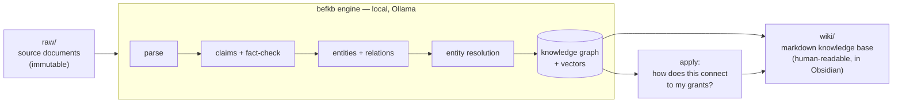

# LLM Wiki Agents for Earth Fund

An AI knowledge system for the **Bezos Earth Fund** that turns the firehose of AI‑for‑climate‑and‑nature
material — papers, blog posts, slide decks, meeting notes, grants, grant reports — into a **connected,
cited, queryable knowledge base**, and answers the question that matters to a funder:

> **"Given this new piece of content, how does it connect to — or apply to — my grants and current work?"**

It is *not* plain RAG (which re‑derives an answer from raw chunks every time) and *not* a scoring tool.
It **compiles knowledge once** into a persistent knowledge graph + markdown wiki, keeps it current, and
surfaces the **relationships, contradictions, and tensions** across everything it has read — including
when a new critique *challenges* a grant you fund.

Runs **entirely on your machine**: local LLMs via [Ollama], no Docker, no servers, no cloud key required.

[Ollama]: https://ollama.com

---

## Two parts, one system



| Part | What it is | Where |
|---|---|---|
| **`befkb` engine** | A local‑first Python engine: ingest any doc → knowledge graph + fact‑checked claims → the *"how does this apply to my grants?"* query. | [`befkb/`](befkb/) |
| **The markdown wiki** | An LLM‑maintained knowledge base (Karpathy's *LLM Wiki* pattern): the evaluative schema, deep‑research analyses, the AI‑for‑climate‑and‑nature landscape, and the engine's filed answers — browsable in Obsidian. | [`wiki/`](wiki/) |

---

## Quick start (the engine)

```bash
# 1. prerequisites: install uv (https://docs.astral.sh/uv) and Ollama (https://ollama.com), then:
ollama pull qwen2.5:7b-instruct      # extraction / claims / narration
ollama pull nomic-embed-text         # embeddings

# 2. install + run
cd befkb
uv sync
uv run befkb ingest /path/to/a-paper.pdf            # build the knowledge graph
uv run befkb apply  /path/to/a-new-paper.pdf        # "how does this connect to my grants?"
```

Full walkthrough: **[docs/USER_GUIDE.md](docs/USER_GUIDE.md)** · Worked examples: **[docs/USE_CASES.md](docs/USE_CASES.md)** · How it's built: **[docs/ARCHITECTURE.md](docs/ARCHITECTURE.md)**

---

## Repository map

```
LLM Wiki Agents for Earth Fund/
├── README.md                 ← you are here
├── CLAUDE.md                 ← the "schema": how the agent maintains the markdown wiki
├── docs/
│   ├── USER_GUIDE.md         ← step-by-step: install, ingest, apply, query
│   ├── USE_CASES.md          ← worked examples with real output
│   └── ARCHITECTURE.md       ← diagrams: structure, pipeline, components
├── befkb/                    ← the comprehension-and-connection ENGINE (Python, uv)
│   ├── src/befkb/            ← parse · claims · extract · resolve · graphstore · retrieve · applicability
│   ├── tests/                ← 94 tests
│   ├── README.md             ← engine-specific readme
│   └── KNOWN_ISSUES.md       ← the v0.2 hardening backlog (from an adversarial code review)
├── wiki/                     ← the markdown KNOWLEDGE BASE (the human-facing artifact)
│   ├── _schema/              ← the BEF AI-knowledge model (evaluative ontology)
│   ├── analyses/             ← filed deep-research (enterprise scaling, the "middle" framework…)
│   ├── topics/               ← the AI-for-climate-and-nature landscape map
│   └── index.md · log.md · overview.md
├── raw/                      ← drop source documents here (PDFs are gitignored — see raw/SOURCES.md)
└── tools/                    ← optional local tooling
```

## Status

**Engine: v0.1 — works end‑to‑end on real documents, locally.** Demonstrated by ingesting a method paper
(RL for conservation prioritization) and a critique (relational accountability), then correctly surfacing
that the critique **challenges** a grant's "top‑down optimization" approach — a cited, idea‑level connection
filed back into the wiki. The data‑integrity bugs found by an adversarial code review are fixed; the
remaining perf/edge‑case backlog is in [`befkb/KNOWN_ISSUES.md`](befkb/KNOWN_ISSUES.md). Real grant data,
richer document parsing (Docling), graph‑DB scaling (Graphiti/Neo4j), and multi‑user/permissions are the
deliberate **Phase‑2+ roadmap** — see [docs/ARCHITECTURE.md](docs/ARCHITECTURE.md).

---

*Part of [AgentsForEarthFund](https://github.com/armashariki/AgentsForEarthFund), alongside Hot Science
Research Agents. Designed and built with [Claude Code](https://claude.com/claude-code) — the architecture
was chosen by a multi‑agent design review and validated by adversarial code review (see the docs).*
