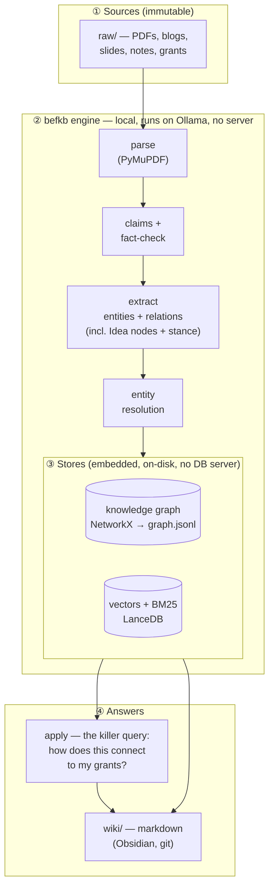
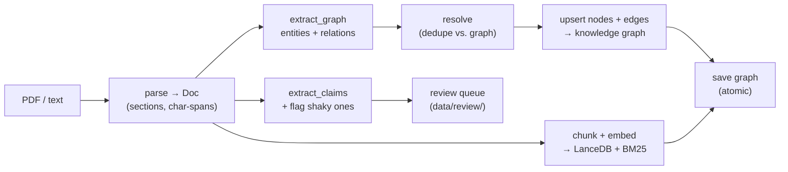
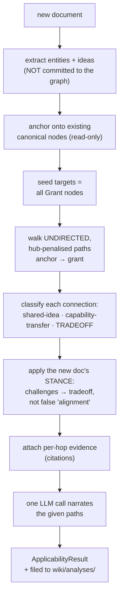
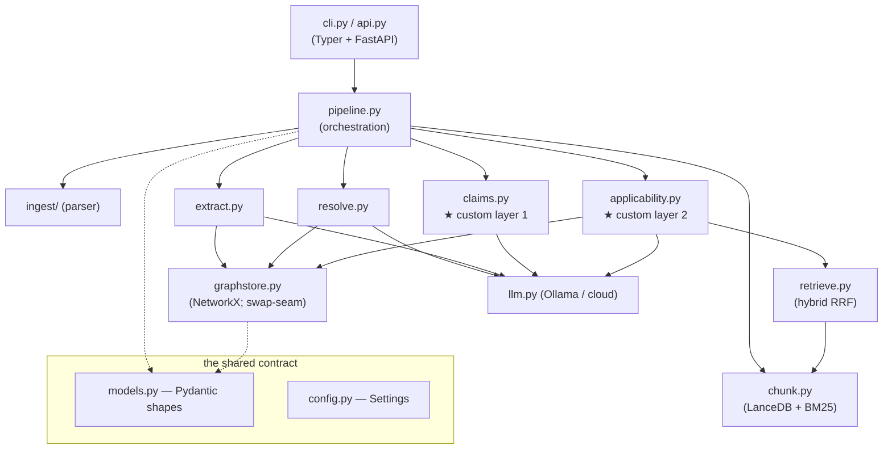

# Architecture

How **LLM Wiki Agents for Earth Fund** is built — the system structure, the data‑flow pipeline, and the
source‑code components. All diagrams render natively on GitHub.

---

## 1. The big picture

The system has two halves that share one markdown knowledge base:

- **`befkb` — the comprehension‑and‑connection engine.** A local‑first Python package that turns documents
  into a connected knowledge graph and answers *"how does this connect to my grants?"*.
- **The LLM Wiki.** An AI‑maintained markdown knowledge base (Karpathy's *LLM Wiki* pattern). The engine
  writes into it; an agent (Claude Code, governed by [`../CLAUDE.md`](../CLAUDE.md)) also curates it.

**Design stance:** the knowledge graph is the *spine*; the markdown wiki is a human‑readable *view*. This
closes the gap that no off‑the‑shelf GraphRAG system fills — exporting a knowledge graph back to a wiki.

---

## 2. Ingest pipeline (`befkb ingest`)

What happens to a single document, step by step:

Every node and edge carries a **citation** back to the source text — so any answer is *cited by
construction*.

---

## 3. The killer query (`befkb apply`)

*"Given this new document, how does it connect to my grants?"* — discovered **structurally** in the graph;
the language model only *narrates* a path it cannot invent.

Two design choices make this work where naive approaches fail:
1. **Undirected traversal** — the gold connection `paper —applies-idea→ idea ←applies-idea— grant` has *no*
   directed path; directed shortest‑path returns nothing.
2. **Stance‑aware** — a critique that `challenges` a shared idea is a **tension**, not an overlap. The new
   doc's own edges drive the valence so a critique is never narrated as agreement.

---

## 4. Source‑code components

Each module is a swappable seam (interface), so parts can be upgraded without a rewrite.

★ = the two layers no open‑source system provides off the shelf, so they are **owned here**:
**claim fact‑checking** and the **applicability/connection query**.

| Module | Responsibility |
|---|---|
| `models.py` | The data contract — every shape (Node, Edge, Claim, Connection…), 1:1 with the wiki ontology. |
| `config.py` | One `Settings` object (paths, model names, thresholds). |
| `llm.py` | Provider‑agnostic LLM + embeddings — **Ollama default**, cloud opt‑in via one env var. |
| `ingest/` | `Parser` protocol + PyMuPDF / text parsers (Docling is a future drop‑in). |
| `chunk.py` | Chunking + embedded **LanceDB** vectors + **BM25** lexical index. |
| `extract.py` | Schema‑constrained entity/relation extraction — emits abstract **Idea** nodes + **stance**. |
| `resolve.py` | Entity resolution (dedupe) with a confidence gate; read‑only `anchor()` for the query. |
| `graphstore.py` | The knowledge‑graph spine (NetworkX) behind a `GraphStore` interface — **the swap‑seam** to Graphiti/Neo4j later. |
| `retrieve.py` | Hybrid retrieval (vector ∪ BM25, fused with Reciprocal Rank Fusion). |
| `claims.py` | **★** Claim extraction + shaky‑flagging — *assists* a human, never asserts truth. |
| `applicability.py` | **★** The killer query — anchor → multi‑hop traversal → cited narration. |
| `pipeline.py` | Orchestrates ingest / apply; writes to the wiki + a log. |
| `cli.py` / `api.py` | Typer CLI + a thin FastAPI (the seam where auth/permissions attach later). |

---

## 5. Technology choices (and why)

| Layer | Choice | Why |
|---|---|---|
| LLM + embeddings | **Ollama** (`qwen2.5:7b‑instruct`, `nomic‑embed‑text`) | Local‑first, free, offline, no key. Cloud is a config flip for higher quality. |
| Knowledge graph | **NetworkX** → `graph.jsonl` | Embedded, zero‑server, diffable, free multi‑hop traversal. Swappable to Graphiti/Neo4j at scale. |
| Vectors + lexical | **LanceDB** (embedded) + **rank‑bm25** | No server; hybrid retrieval via RRF. Swappable to Qdrant. |
| Parsing | **PyMuPDF** | Near‑pure, fast, no heavy deps. Docling is a later adapter for slides/scans. |
| Packaging / API | **uv** · **Typer** · **FastAPI** | One command to run; CLI now, API for colleagues later. |

This **lean, zero‑server design won a multi‑agent architecture review** against heavier alternatives
(R2R‑in‑Docker, a Graphiti+Neo4j assembly) — chosen because the operator is a solo builder on a Mac with
no Docker, and the killer query is fundamentally a graph‑traversal problem.

---

## 6. Roadmap (deliberately deferred)

The `GraphStore`, `Parser`, `LLMClient`, and `Retriever` interfaces exist so the following are **backend
swaps, not rewrites**:

| Phase | Adds | Swap |
|---|---|---|
| 1.5 | Harden claim‑contradiction detection; ingest the real grant portfolio | — |
| 2 | Richer parsing for slides/scans/tables | `Parser` → **Docling** |
| 3 | Scale to 1k–10k docs (temporal KG, robust entity resolution) | `GraphStore` → **Graphiti/Neo4j**; LanceDB → **Qdrant** |
| 4 | Colleagues + permissions (SSO, audit, document‑level ACLs) | API seam → **Onyx**‑style backbone + permission‑tiered synthesis |

The reasoning behind each is in [`../wiki/analyses/`](../wiki/analyses/) (the build‑vs‑buy and "middle‑framework" research that drove these decisions). Open bugs/limitations: [`../befkb/KNOWN_ISSUES.md`](../befkb/KNOWN_ISSUES.md).
